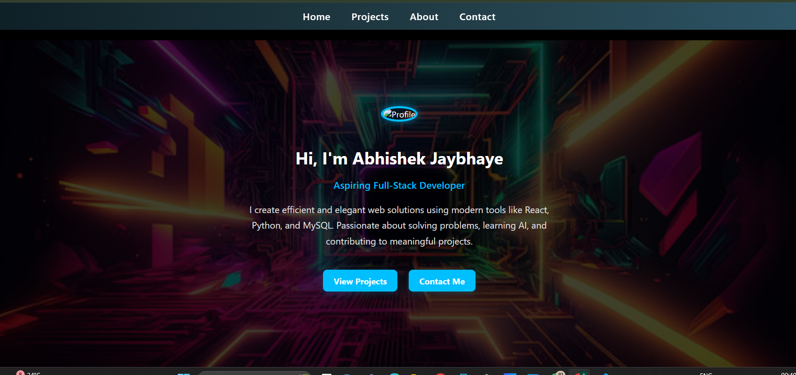
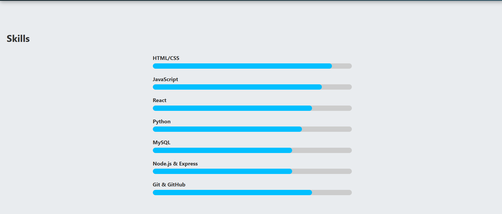
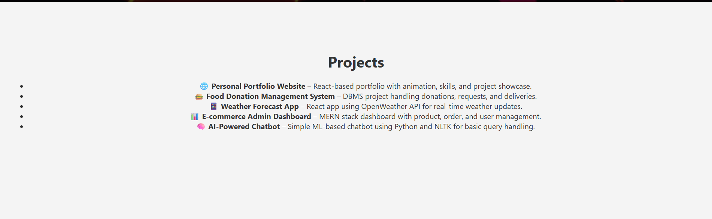

# 💼 Personal Portfolio Website

This is a modern and responsive personal portfolio website built using **React.js**, showcasing my skills, projects, and contact information.

## 🔗 Live Demo

👉 [View Live](https://abhishekjaybhaye7551.github.io/my-portfolio)

---

## 🖼️ Screenshots

> 📸 Make sure to save these images inside a `/screenshots` folder in your project directory and commit them.

### 🏠 Home Section  


### 👤 About Section  


### 🛠️ Skills Section  


### 📁 Projects Section  


### 📬 Contact Section  


---

## 🚀 Features

- Animated landing section with particle effects
- Typewriter introduction for roles
- Responsive design across all devices
- Scroll animations and smooth navigation
- Project list with icons and highlights
- Integrated contact and social links

---

## 🛠️ Tech Stack

- **Frontend:** React.js, HTML5, CSS3, JavaScript
- **Animation:** Framer Motion, React Simple Typewriter
- **Visuals:** React Tsparticles, custom CSS effects
- **Version Control:** Git & GitHub

---

## 📦 Installation

Clone the repo and install dependencies:

```bash
git clone https://github.com/Abhishekjaybhaye7551/my-portfolio.git
cd my-portfolio
npm install
npm start
